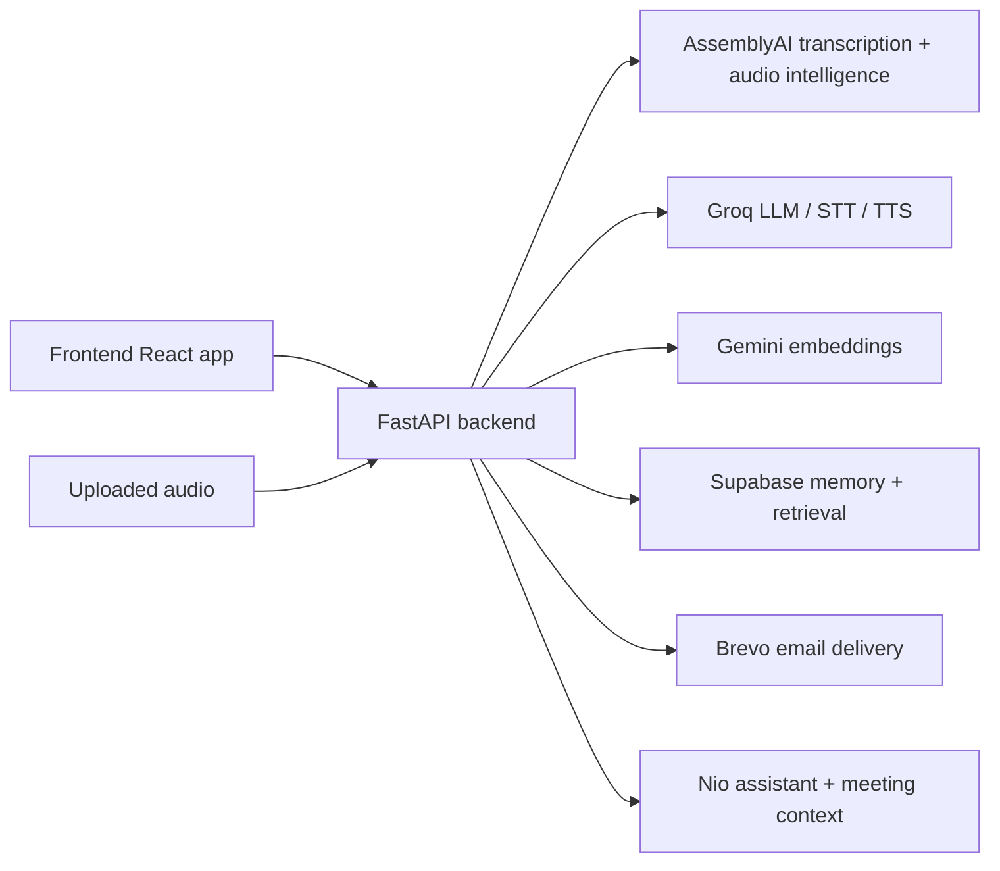

# MeetCore

MeetCore is an AI-powered meeting intelligence platform built around AssemblyAI. It turns uploaded meeting audio into structured operational memory—capturing action items, deadlines, decisions, and key context so teams can move from conversation to execution immediately after a call ends.

Instead of leaving teams with raw transcripts and scattered notes, MeetCore transforms spoken discussion into an intelligent, searchable workflow. AssemblyAI powers the transcription and audio intelligence layer, while a meeting-aware assistant, Nio, helps users ask questions and get answers grounded in what was actually said.

## Why this project exists

Most meetings generate valuable decisions and follow-ups, but those details are often lost after the call ends. MeetCore preserves that context by:

- extracting tasks and assigned owners
- resolving deadlines and delivery windows
- identifying key decisions and follow-ups
- indexing transcript content for instant retrieval
- enabling post-meeting Q&A through a context-aware assistant

## Product snapshot

- Upload meeting audio and queue background processing
- Use AssemblyAI for transcription and spoken content analysis
- Extract decisions, action items, priorities, and deadlines
- Store structured meeting data in Supabase for retrieval and memory
- Ask Nio questions grounded in the meeting transcript and summary
- Generate summaries and draft follow-up emails automatically

## Architecture



## Tech stack

### Frontend
- React 18
- Vite
- Tailwind-based styling and animated UI components
- Meeting upload and assistant screen flow

### Backend
- FastAPI
- Pydantic
- Async service orchestration
- Background processing for upload status tracking

### AI and integrations
- AssemblyAI for transcription and meeting intelligence
- Groq for chat, STT, and TTS
- Google Gemini embeddings for transcript chunk retrieval
- Supabase for meeting records and vector search storage
- Brevo for email dispatch

## Repository structure

```text
meetcore/
├── backend/
│   ├── app/
│   │   ├── core/
│   │   │   ├── config.py
│   │   │   └── nio_prompt.py
│   │   ├── models/
│   │   │   └── meeting.py
│   │   ├── routers/
│   │   │   ├── nio_chat.py
│   │   │   ├── realtime_token.py
│   │   │   ├── stt.py
│   │   │   ├── tts.py
│   │   │   ├── tools.py
│   │   │   └── upload.py
│   │   ├── services/
│   │   │   ├── assemblyai_service.py
│   │   │   ├── email_service.py
│   │   │   ├── planning_agent.py
│   │   │   ├── rag_service.py
│   │   │   ├── supabase_service.py
│   │   │   └── validation.py
│   │   └── main.py
│   ├── requirements.txt
│   ├── schema.sql
│   ├── debug_key.py
│   ├── test_aai.py
│   └── test_llm.py
├── frontend/
│   ├── src/
│   ├── package.json
│   ├── vite.config.js
│   ├── tailwind.config.js
│   └── index.html
├── extract_fluid.py
├── fix.py
├── test_tools.py
├── README.md
├── .gitignore
└── .env.example (if added outside repo)
```

## Core runtime flow

### 1. Upload a meeting
The upload endpoint in [backend/app/routers/upload.py](backend/app/routers/upload.py) accepts a file, creates a meeting id, and starts a background processing pipeline.

### 2. Process transcript and structured metadata
The app retrieves transcript text and uses extraction logic to identify:

- action items
- assigned owners
- deadlines
- decisions
- priority brief

These are normalized into Pydantic models in [backend/app/models/meeting.py](backend/app/models/meeting.py).

### 3. Save to Supabase
Stored records include transcript text, summary, task list, deadline list, decisions, and chapter metadata. Retrieval logic is handled in [backend/app/services/supabase_service.py](backend/app/services/supabase_service.py).

### 4. Answer post-meeting questions
The Nio assistant in [backend/app/routers/nio_chat.py](backend/app/routers/nio_chat.py) combines:

- meeting summary
- priority brief
- extracted task/deadline/decision data
- retrieved transcript chunks from RAG

This allows conversational Q&A about the meeting without re-listening to the whole call.

### 5. Extra tools and actions
The tools router in [backend/app/routers/tools.py](backend/app/routers/tools.py) supports:

- transcript retrieval
- summary generation
- action item lookup
- draft email generation
- background email sending

## Key features

### Meeting intelligence
- file upload and processing pipeline
- transcription and metadata extraction
- decision, task, and deadline capture
- executive summary / priority brief generation

### Nio assistant
- meeting-scoped conversations
- context-aware response generation
- retrieval from transcript chunks
- specialist routing logic in [backend/app/services/planning_agent.py](backend/app/services/planning_agent.py)

### Real-time audio experience
- AssemblyAI realtime token flow
- Groq Whisper transcription endpoint
- Groq TTS voice output for spoken responses

### Email automation
- dynamic summary email building
- Brevo API integration for sending follow-up messages

## Environment variables

The app reads configuration from [backend/app/core/config.py](backend/app/core/config.py). Create a local `.env` file in the backend directory with values like:

```env
ASSEMBLYAI_API_KEY=your_assemblyai_key
GROQ_API_KEY=your_groq_key
GEMINI_API_KEY=your_gemini_key
SUPABASE_URL=https://your-project.supabase.co
SUPABASE_SERVICE_KEY=your_supabase_service_key
BREVO_API_KEY=your_brevo_key
BREVO_SENDER_EMAIL=hello@yourdomain.com
BREVO_SENDER_NAME="Nio from MeetCore"
GOOGLE_CLIENT_ID=optional
GOOGLE_CLIENT_SECRET=optional
GOOGLE_REDIRECT_URI=optional
ENV=development
```

## Local setup

### Backend

```bash
cd /workspaces/meetcore/backend
python3 -m venv .venv
source .venv/bin/activate
pip install -r requirements.txt
uvicorn app.main:app --reload --host 0.0.0.0 --port 8000
```

### Frontend

```bash
cd /workspaces/meetcore/frontend
npm install
npm run dev -- --host 0.0.0.0 --port 3000
```

### Access points

- Frontend: http://localhost:3000
- API docs: http://localhost:8000/docs
- Backend API base: http://localhost:8000

The frontend proxy in [frontend/vite.config.js](frontend/vite.config.js) forwards `/api` requests to the FastAPI service.

## API overview

| Route | Method | Purpose |
| --- | --- | --- |
| `/health` | GET | health check |
| `/upload` | POST | upload a meeting audio file |
| `/upload/status/{meeting_id}` | GET | poll processing status |
| `/nio/ask` | POST | ask Nio about the meeting |
| `/tools/transcript` | POST | fetch transcript text |
| `/tools/summary` | POST | fetch or generate summary |
| `/tools/action-items` | POST | fetch action items |
| `/tools/draft-email` | POST | draft an email from meeting context |
| `/tools/send-email` | POST | send a background email |
| `/realtime-token` | POST | mint a short-lived AssemblyAI token |
| `/stt` | POST | transcribe uploaded audio |
| `/tts` | POST | generate spoken audio |

## Project status

This repository is an MVP prototype with a working backend flow and frontend demo experience. Some modules are partially implemented or legacy/commented code paths, but the live product direction is clear and centered on:

- [backend/app/main.py](backend/app/main.py)
- [backend/app/routers/upload.py](backend/app/routers/upload.py)
- [backend/app/routers/nio_chat.py](backend/app/routers/nio_chat.py)
- [backend/app/services/supabase_service.py](backend/app/services/supabase_service.py)
- [frontend/src/App.jsx](frontend/src/App.jsx)
- [frontend/src/pages/UploadScreen.jsx](frontend/src/pages/UploadScreen.jsx)

## Notes on data model

Meeting records carry structured values such as:

- meeting id and transcript id
- status and upload date
- summary and priority brief
- tasks, deadlines, and decisions
- transcript text and chapter metadata
- sentiment summary

This schema is defined in [backend/app/models/meeting.py](backend/app/models/meeting.py).

## Suggested next steps

- add a migration workflow for Supabase schema changes
- harden validation and failure handling for AI services
- improve frontend state management around tool execution
- add automated tests for API and extraction logic
- replace heuristic routing with a more robust planning layer

## License

There is no explicit license file in the repository yet. If you plan to distribute this project publicly or commercially, add an appropriate license before release.

## Summary

MeetCore turns meeting audio into execution-ready insight. Powered by AssemblyAI, it converts discussions into structured memory, searchable context, and a meeting-aware AI assistant that helps teams act on what was decided.
