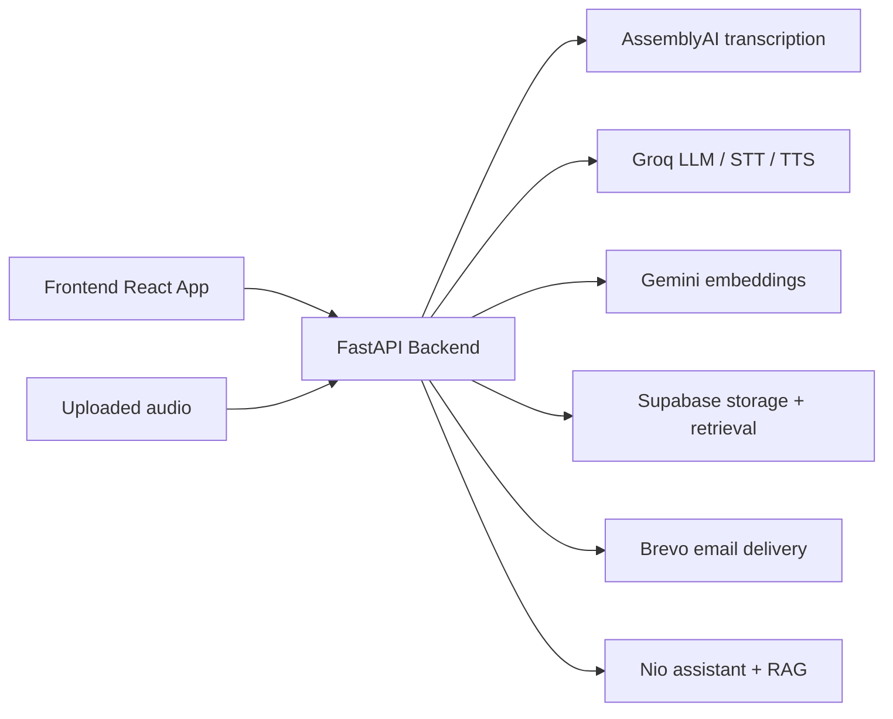

# MeetCore

MeetCore is a meeting intelligence application that turns uploaded audio into structured outputs such as summaries, task lists, deadlines, decisions, and an interactive assistant called Nio. The system combines transcription, AI extraction, retrieval-augmented question answering, and follow-up email generation to help teams move from conversation to action.

## Overview

MeetCore follows a simple flow:

1. A user uploads a meeting recording.
2. The backend sends the audio to AssemblyAI for transcription.
3. Structured analysis extracts action items, deadlines, decisions, and priority context.
4. Data is stored in Supabase.
5. A chat assistant answers questions using the meeting summary and transcript chunks via RAG.
6. The user can request transcript views, summaries, or draft emails.

## Product Goals

- Turn raw meeting audio into actionable operational memory.
- Surface what matters most: tasks, owners, deadlines, and decisions.
- Answer post-meeting questions without re-listening to the full recording.
- Generate concise executive-ready summaries and follow-up communications.
- Keep the experience lightweight and fast for a single-user or small-team workflow.

## Architecture



## Tech Stack

### Frontend
- React 18
- Vite
- CSS/Tailwind-based UI styling
- Custom animated meeting dashboard

### Backend
- FastAPI
- Pydantic models
- Async HTTP clients for AI services
- Background task processing for upload pipeline status

### AI and data services
- AssemblyAI: transcription and meeting intelligence
- Groq: chat, transcription, and TTS
- Google Gemini: embeddings for transcript chunk retrieval
- Supabase: persistent storage for meeting records and chunk search
- Brevo: outbound email dispatch

## Repository Structure

```text
meetcore/
├── backend/
│   ├── app/
│   │   ├── core/
│   │   │   ├── config.py          # Environment configuration and model settings
│   │   │   └── nio_prompt.py      # Nio assistant character + context formatting
│   │   ├── models/
│   │   │   └── meeting.py         # Pydantic models for meetings/tasks/deadlines/decisions
│   │   ├── routers/
│   │   │   ├── nio_chat.py        # /nio/ask assistant endpoint
│   │   │   ├── realtime_token.py  # AssemblyAI realtime token endpoint
│   │   │   ├── stt.py             # Groq Whisper transcription endpoint
│   │   │   ├── tools.py           # Summary, transcript, action item, and email tools
│   │   │   ├── tts.py             # TTS endpoint for spoken responses
│   │   │   └── upload.py          # Upload pipeline + status tracking
│   │   ├── services/
│   │   │   ├── assemblyai_service.py
│   │   │   ├── email_service.py
│   │   │   ├── planning_agent.py
│   │   │   ├── rag_service.py
│   │   │   ├── supabase_service.py
│   │   │   └── validation.py
│   │   └── main.py               # FastAPI app entry point
│   ├── requirements.txt
│   ├── schema.sql                # Database schema hints for Supabase
│   ├── debug_key.py
│   ├── test_aai.py
│   └── test_llm.py
├── frontend/
│   ├── src/
│   ├── package.json
│   ├── vite.config.js
│   ├── tailwind.config.js
│   └── index.html
├── extract_fluid.py
├── fix.py
├── test_tools.py
├── README.md
└── .gitignore
```

## Main Runtime Flow

### 1. Upload and process meeting audio
The upload flow is handled by the backend router in [backend/app/routers/upload.py](backend/app/routers/upload.py). Once a file is posted to the upload endpoint:

- A UUID-based meeting id is created.
- The file is read and validated.
- A background task is kicked off.
- AssemblyAI uploads the file and creates a transcript job.
- Transcript text and AI metadata are gathered.
- Tasks, deadlines, decisions, and brief summaries are extracted.
- The result is saved to Supabase.

### 2. Digestion and structured extraction
This project includes extraction logic under the [backend/app/tools](backend/app/tools) directory. These tools are responsible for capturing:

- action items and owners
- deadlines and due date logic
- key decisions
- priority brief or executive-level summary

The data is normalized into Pydantic models defined in [backend/app/models/meeting.py](backend/app/models/meeting.py).

### 3. Retrieval and chat
The assistant in [backend/app/routers/nio_chat.py](backend/app/routers/nio_chat.py) uses:

- meeting summary and structured metadata
- retrieved transcript chunks from Supabase
- an LLM call with a carefully designed system prompt

This makes Nio feel like a post-meeting chief of staff rather than a generic bot.

### 4. Follow-up tools
The tools API in [backend/app/routers/tools.py](backend/app/routers/tools.py) exposes endpoints for:

- transcript retrieval
- summary generation
- action item extraction
- draft email generation
- background email dispatch

## Key Features

### Meeting intelligence
- Audio upload pipeline
- Transcript enrichment and structured metadata
- Decision, task, and deadline extraction
- Meeting summary and executive brief generation

### Nio assistant
- Context-aware conversational Q&A
- RAG retrieval over transcript chunks
- Tool-call style interactions for transcript, summary, and email actions
- Guardrail-based response planning through [backend/app/services/planning_agent.py](backend/app/services/planning_agent.py)

### Real-time interaction
- AssemblyAI realtime token endpoint
- Groq Whisper transcription for ultra-fast speech-to-text
- Groq TTS for spoken voice responses

### Email automation
- Dynamic HTML meeting email generation
- Brevo API integration for sending summaries and follow-up notes

## Environment Setup

The project expects environment variables to be available in the runtime environment. The values are read in [backend/app/core/config.py](backend/app/core/config.py).

Create a `.env` file in the `backend` directory (or export the variables in your shell before starting the API):

```env
ASSEMBLYAI_API_KEY=your_assemblyai_key
GROQ_API_KEY=your_groq_key
GEMINI_API_KEY=your_gemini_key
SUPABASE_URL=https://your-project.supabase.co
SUPABASE_SERVICE_KEY=your_supabase_service_key
BREVO_API_KEY=your_brevo_key
BREVO_SENDER_EMAIL=hello@yourdomain.com
BREVO_SENDER_NAME="Nio from MeetCore"
GOOGLE_CLIENT_ID=optional
GOOGLE_CLIENT_SECRET=optional
GOOGLE_REDIRECT_URI=optional
ENV=development
```

## Local Development

### Backend

```bash
cd /workspaces/meetcore/backend
python3 -m venv .venv
source .venv/bin/activate
pip install -r requirements.txt
uvicorn app.main:app --reload --host 0.0.0.0 --port 8000
```

### Frontend

```bash
cd /workspaces/meetcore/frontend
npm install
npm run dev -- --host 0.0.0.0 --port 3000
```

Then open:

- Frontend: http://localhost:3000
- API: http://localhost:8000/docs

The frontend proxy in [frontend/vite.config.js](frontend/vite.config.js) redirects `/api` calls to the local FastAPI backend.

## API Summary

| Endpoint | Method | Purpose |
| --- | --- | --- |
| `/health` | GET | Liveness check |
| `/upload` | POST | Upload an audio file and queue processing |
| `/upload/status/{meeting_id}` | GET | Poll processing status and events |
| `/nio/ask` | POST | Ask Nio a question about a meeting |
| `/tools/transcript` | POST | Fetch transcript text |
| `/tools/summary` | POST | Fetch or synthesize a summary |
| `/tools/action-items` | POST | Return tasks and action items |
| `/tools/draft-email` | POST | Generate a tailored follow-up email |
| `/tools/send-email` | POST | Dispatch an email asynchronously |
| `/realtime-token` | POST | Get a short-lived AssemblyAI streaming token |
| `/stt` | POST | Run speech-to-text on uploaded audio |
| `/tts` | POST | Generate spoken audio responses |

## Data Model Notes

Meeting records are stored with a combination of:

- meeting id and transcript id
- status, upload date, summary, and priority brief
- structured lists for tasks, deadlines, and decisions
- chapters and sentiment metadata
- transcript text for answer generation

This structure is defined in [backend/app/models/meeting.py](backend/app/models/meeting.py) and persisted via [backend/app/services/supabase_service.py](backend/app/services/supabase_service.py).

## Current Project State

This repository is an MVP/prototype with working backend patterns and a front-end meeting experience scaffold. Some modules are either partially implemented, commented, or experimental, including portions of the original TTS/STT and older UI code. The active application path is centered on:

- [backend/app/main.py](backend/app/main.py)
- [backend/app/routers/upload.py](backend/app/routers/upload.py)
- [backend/app/routers/nio_chat.py](backend/app/routers/nio_chat.py)
- [backend/app/services/supabase_service.py](backend/app/services/supabase_service.py)
- [frontend/src/App.jsx](frontend/src/App.jsx)
- [frontend/src/pages/UploadScreen.jsx](frontend/src/pages/UploadScreen.jsx)

## License

This project does not currently include an explicit license file. If you plan to distribute or reuse the code, add a repository license before production use.

## Suggested Next Steps

- Add a real database migration workflow for Supabase.
- Harden validation and error handling around uploads and downstream AI services.
- Improve the frontend state management around tool execution and assistant responses.
- Add automated tests for endpoints, extraction logic, and configuration safety.
- Replace heuristic planning logic with a more robust routing layer.

## Summary

MeetCore is designed to help teams move from spoken conversation to action-oriented organization. It compresses long meetings into useful knowledge, keeps memory searchable, and gives teams a conversational layer that can answer direct operational questions right after the call ends.
